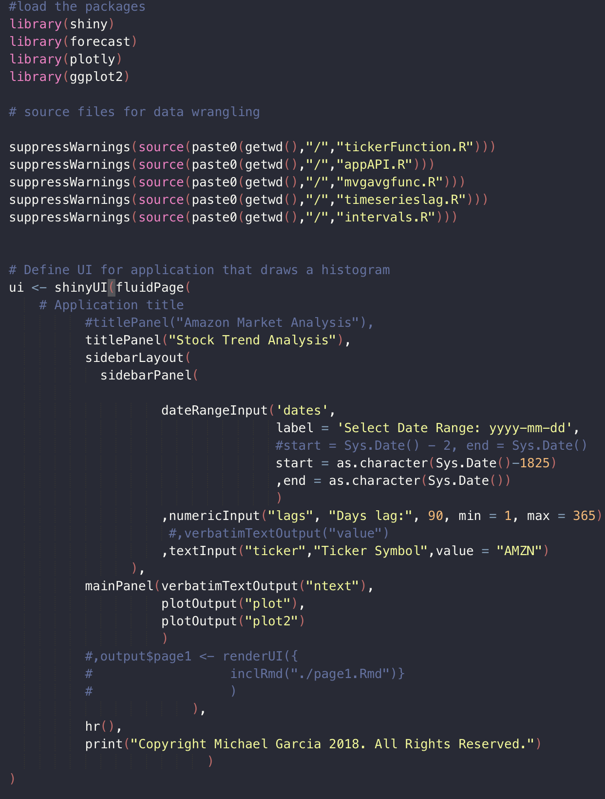
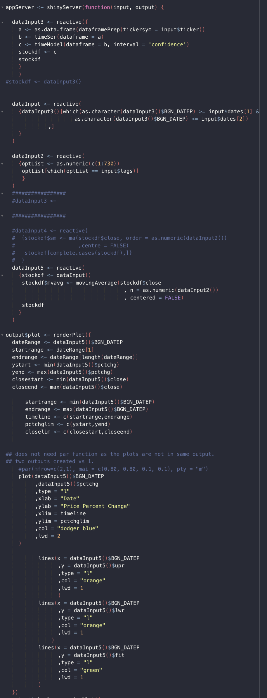
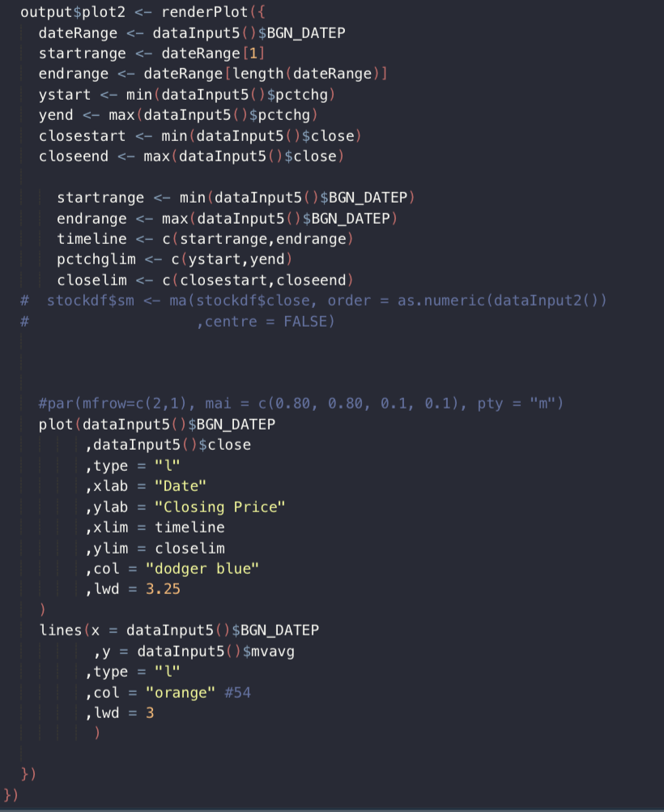

Shiny App Presentation
========================================================
author: Michael Garcia
date: August 14, 2018
autosize: true

Introduction
========================================================

The Stock Analysis app is used to provide a graphical representation of the
price changes and the closing price for a particular stock.

- First graph plots price change percent with upper and lower confidence intervals
 - Also includes fitted line
- Second graph plots closing price with a simple moving average.
 - This plot can change the number of days lag
- Both graphs can be adjusted for the date range

Benefits:
- Quick view in trends for price changes and simple moving average
- Ability to adjust the lag days in simple moving average trend
- Ability to view NYSE ticker symbol

UI Code
========================================================

Server Code Part 1
========================================================

Server Code Part 2
========================================================

Slide With Price Change Plot
========================================================

- Includes upper and lower confidence intervals
- Includes fitted line

Slide with Closing Price Plot
========================================================

- Closing Price plot
- Includes simple moving average

Slide with Closing Price Plot
========================================================

Options Include:
- Date range parameters
- Ability to select 2 years days lag calculation
- Ticker symbol input and analysis on NYSE ticker symbol
- Closing Price plot
- Includes simple moving average
