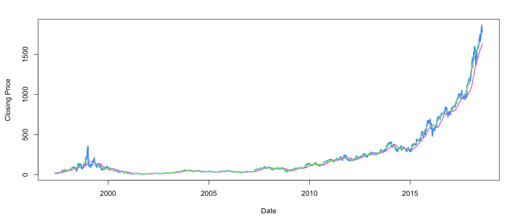

Shiny App Presentation
========================================================
author: Michael Garcia
date: August 1, 2018
autosize: true

First Slide
========================================================

The Stock Analysis app is used to provide a graphical representation of the
price changes and the closing price for a particular stock.

- First graph plots price change percent with upper and lower confidence intervals
 - Also includes fitted line
- Second graph plots closing price with a simple moving average.
 - This plot can change the number of days lag
- Both graphs can be adjusted for the date range

Slide With Code
========================================================


```r
direc <- paste0(getwd(),"/","tickerFunction.R")
direc2 <- paste0(getwd(),"/","appAPI.R")

source(direc)
source(direc2)

head(stockdf,2)
```

```
   BGN_DATEP close
1 1997-05-15 23.50
2 1997-05-16 20.75
```

Slide With Price Change Plot
========================================================


- Includes upper and lower confidence intervals
- Includes fitted line

Slide with Closing Price Plot
========================================================

- Closing Price plot
- Includes simple moving average

Slide with Closing Price Plot
========================================================

- Closing Price plot
- Includes simple moving average
